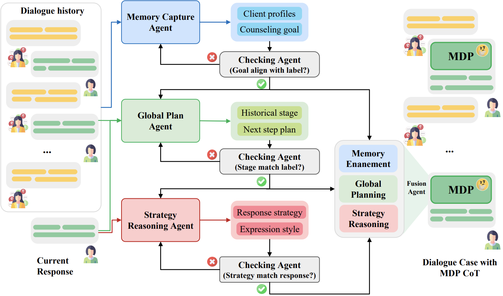
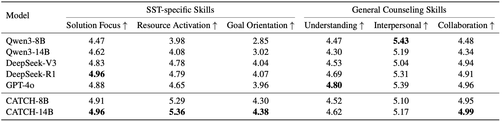
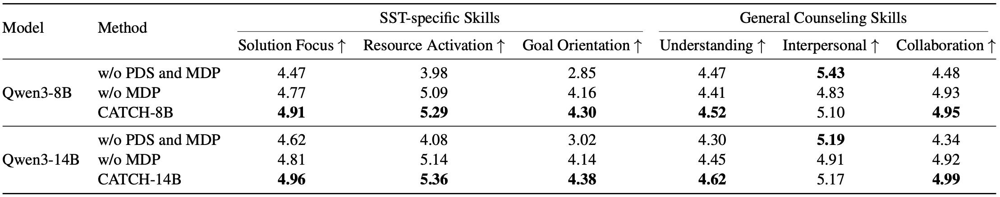

# [SoulChat-R1: SST-based Multi-turn Psychological Counseling CoT Dataset](https://github.com/scutcyr/SoulChat-R1)

<p align="center">
    <a href="https://arxiv.org/pdf/2412.13660"></a>
    <a href="./LICENSE"></a>
    <a href="support os"></a>
    <a href="https://github.com/scutcyr/SoulChat-R1/graphs/contributors"></a>
    <a href="https://github.com/scutcyr/SoulChat-R1/commits"></a>
    <a href="https://github.com/scutcyr/SoulChat-R1/issues"></a>
    <a href="https://github.com/scutcyr/SoulChat-R1/stargazers"></a>
</p>

\[ [中文](./README_zh.md) | English \]

## Recent Updates
- ğŸ‘🻠2025.09.28: Now, you can download the **SoulChat-R1** dataset from：[https://www.modelscope.cn/datasets/YIRONGCHEN/SoulChat-R1](https://www.modelscope.cn/datasets/YIRONGCHEN/SoulChat-R1)!
- ğŸ‘🻠2025.09.04: We are pleased to announce that our work: [CATCH: A Novel Data Synthesis Framework for High Therapy Fidelity and Memory-Driven Planning Chain of Thought in AI Counseling](https://arxiv.org/pdf/2412.13660) <!-- github link to be updated --> has been accepted by EMNLP 2025 Findings! ğŸ‰

## Introduction

Since the release of [SoulChat2.0](https://github.com/scutcyr/SoulChat2.0) in December 2024, we have continuously explored language patterns and intervention mechanisms in real-world counseling scenarios, achieving significant progress in enhancing the therapy fidelity and logical coherence of AI counseling.

Despite the rapid development of LLM-based psychological counseling research in recent years, with works such as SMILE, CPsyCoun, Cactus, and PsyDT advancing the field through data synthesis, these methods generally adopt a "one-time generation" approach to construct multi-turn dialogue data. This generation strategy lacks fine-grained control over each therapeutic stage during data synthesis, making it difficult to ensure that the synthesized data aligns with therapy protocols at every stage, resulting in **low therapy fidelity**. Furthermore, existing synthesized data largely **lacks explicit chain-of-thought (CoT)**, failing to reveal the decision-making rationale and reasoning process behind each counselor response. Models trained on such data often merely imitate surface-level conversational patterns, unable to deeply understand and master the underlying therapeutic logic.

These limitations cause AI counseling models to be prone to **therapy drift** during actual conversations—where the dialogue gradually deviates from the intended therapeutic trajectory—compromising intervention effectiveness and professional credibility. To systematically address these issues, the Future Technology College at South China University of Technology and the Guangdong Provincial Key Laboratory of Human Digital Twin, building upon their prior work, propose the CATCH framework, aiming to construct a high-fidelity, explainable AI counseling data and model system.

## Methodology

**CATCH** is an innovative data synthesis framework, whose core lies in solving two key challenges in AI counseling: **low therapy fidelity** and **opaque decision logic**. To this end, CATCH consists of two complementary components:

1.  **Progressive Dialogue Synthesis (PDS)**: Enhances the **therapy fidelity** of dialogues.
2.  **Memory-driven Dynamic Planning Chain-of-Thought (MDP CoT)**: Reveals the **decision-making rationale** behind each response.

### (1) Progressive Dialogue Synthesis (PDS)

To overcome the issues of disordered therapeutic processes and low fidelity caused by the existing "one-time generation" method, CATCH proposes the **Progressive Dialogue Synthesis (PDS)** strategy. PDS strictly adheres to the theoretical framework of **Single-Session Therapy (SST)**, decomposing the counseling process into three structured stages: **Goal Identification**, **Working**, and **Ending**. The dialogue content is not generated all at once but is synthesized **incrementally, stage by stage**, ensuring that each interaction precisely aligns with the established therapeutic protocol.

The PDS process begins with authentic client self-reports. First, a Large Language Model (LLM) extracts and generates the core therapeutic elements required for each stage from the self-report, forming a structured **dialogue outline**:

*   **Counseling Goal**: Based on the client's self-report, generate a goal that is unique, specific, feasible, positive, evaluable, and focused on internal psychological processes.
*   **Resources**: In conjunction with the counseling goal, systematically explore and generate resources, including the client's internal strengths (e.g., past coping experiences) and external supports (e.g., social relationships).
*   **Solution**: Identify "positive resources" from the generated resources that can effectively support goal attainment, and transform them into a specific, feasible, and independently executable action plan for the client.

This outline, combined with the **Big Five personality traits** extracted from the self-report, guides the dialogue generation. The LLM generates the dialogue for each stage according to the outline. The dialogue for subsequent stages is strictly built upon the output of the previous stage, ultimately stitching together a logically coherent, structurally complete, and high-fidelity multi-turn counseling dialogue.

#### Detailed Explanation of the Three Stages of SST

| Stage | Core Tasks | Key Steps |
| :--- | :--- | :--- |
| **Goal Identification Stage** | Establish a trusting relationship and collaboratively confirm the core counseling goal. | 1.  **Building Alliance**: Establish a safe therapeutic relationship through empathy and unconditional positive regard.<br>2.  **Focusing on the Core**: Guide the client to identify the most urgent and representative problem from a range of concerns.<br>3.  **Confirming the Goal**: Collaboratively negotiate and confirm a clear, psychology-focused goal that meets SST standards. |
| **Working Stage** | Explore resources and transform positive resources into a concrete solution. | 1.  **Exploring Resources**: Systematically uncover the client's internal (e.g., personal qualities, successful experiences) and external resources (e.g., social support).<br>2.  **Transforming into a Solution**: Use techniques like behavioral rehearsal to transform the identified "positive resources" into an actionable plan.<br>3.  **Preparing for Transition**: When the client shows willingness to act, prepare to move to the ending stage. |
| **Ending Stage** | Summarize, provide feedback, reinforce confidence, and assign follow-up actions. | 1.  **Feedback & Summary**: Affirm the client's efforts and progress, reinforcing their positive experiences.<br>2.  **Assigning Homework**: Based on the solution, assign specific "homework" or action plans to consolidate gains.<br>3.  **Closing**: Ensure the session feels complete and constructive, enhancing the client's confidence for facing future challenges. |

<p align="center">
    
</p>

### (2) Memory-driven Dynamic Planning Chain-of-Thought (MDP CoT)

To address the lack of decision logic transparency in synthesized data, CATCH introduces the **Memory-driven Dynamic Planning (MDP)** thinking pattern and constructs the **MDP-CoT** to systematically reveal the complete reasoning process behind each response.

MDP simulates the cognitive process of a professional counselor conducting **case conceptualization**, comprising three progressive steps:

*   **Memory Enhancement**: Reviews and integrates the dialogue history to construct a continuously updated, structured summary of the client's background, emotional state, and goal progress.
*   **Global Planning**: Assesses the current progress, identifies the precise therapeutic stage, and plans the next steps to ensure that short-term interactions serve the long-term goal.
*   **Strategy Reasoning**: Synthesizes the information from memory and planning to select the optimal response strategy for the current turn, including specific therapeutic techniques and expression styles.

Based on this, we designed a **collaborative multi-agent framework** to generate high-quality MDP-CoT:

*   **Memory Capture Agent**: Analyzes the dialogue history to generate a "current state summary" of the client's personal situation, resource status, and counseling goal.
*   **Global Plan Agent**: Determines the exact stage of the session and plans the direction for the next response (maintain, shift step, or transition stage).
*   **Strategy Reasoning Agent**: Analyzes the client's latest statement to reason about the most appropriate response strategy (technique, tone, length).
*   **Checking Agent**: Rigorously verifies each generated step for consistency, logical coherence, and alignment with the final response. If any deviation is detected, it triggers a regeneration mechanism to ensure quality.
*   **Fusion Agent**: Integrates the verified outputs from the three agents into a fluent, natural, first-person inner monologue, forming the final **MDP-CoT**.

<p align="center">
    
</p>

## Experiments

### Evaluation of the PDS Method

To verify the effectiveness of **Progressive Dialogue Synthesis (PDS)** in enhancing therapy fidelity, we compared it with the **one-time generation method**. Using the same LLM and SST knowledge, we generated two sets of dialogues for 60 counseling cases and invited experts to conduct a blind evaluation.

The evaluation covered the following six dimensions, as shown in the table below:

| Dimension | Abbreviation | Focus |
|------|------|----------|
| **Counselor's Coherent Guidance** | CCG | Whether the intervention path is logically progressive, with natural transitions and consistent goals across stages |
| **Goal Identification Stage Performance** | GIS | Whether a trusting relationship is established and a specific, measurable psychological goal meeting SST standards is collaboratively identified |
| **Working Stage Performance** | WS | Whether internal and external resources are systematically explored and effectively guided toward a feasible action plan |
| **Ending Stage Performance** | ES | Whether an appropriate summary is provided, positive feedback is given, and follow-up tasks consistent with the solution are assigned |
| **Dialogue Fluency** | DF | Whether the language is natural and coherent, without repetition, jumps, or semantic breaks |
| **Topic Relevance** | TR | Whether the content remains focused on the core concern, avoiding irrelevant digressions |

<p align="center">
    
</p>

**Results**: PDS-generated dialogues significantly outperformed the one-time generation method on all therapeutic stages (GIS, WS, ES) and counselor guidance coherence (CCG). For instance, PDS received a **78%** expert preference in the GIS stage and a high of **95%** in the WS stage. Moreover, PDS also demonstrated superior stability in DF and TR, indicating that it not only enhances the structural integrity of the therapy but also improves semantic consistency and topic focus.

---

### Overall Model Performance Evaluation

We performed supervised fine-tuning on the **Qwen3-8B** and **Qwen3-14B** base models using the high-quality multi-turn dialogue data (with explicit MDP CoT) generated by the CATCH framework, resulting in the **CATCH-8B** and **CATCH-14B** models. We compared them with advanced models such as GPT-4o, DeepSeek-V3, and DeepSeek-R1 to comprehensively evaluate their performance in Single-Session Therapy (SST).

#### Evaluation Methodology

The evaluation adopted a **dialogue simulation** protocol, following the [COUNSELINGEVAL](https://aclanthology.org/2024.findings-emnlp.832/) paradigm:

1.  **Test Set**: Used the standardized COUNSELINGEVAL test set, containing 150 client profiles with three predefined attitude types (**positive**, **neutral**, **negative**) to assess model robustness.
2.  **Dialogue Simulation**: Employed a **dual-model simulation**:
    *   **Client**: Played by GPT-4o-mini, generating natural, coherent responses based on the profile and attitude.
    *   **Counselor**: Played by the model under evaluation. All models were provided with the same SST knowledge to ensure fairness.
3.  **Evaluator**: Used **GPT-4o** as an automated evaluator (AI evaluator) to score 450 complete dialogues (150 cases × 3 attitudes).
4.  **Reliability Validation**: Randomly selected 60 samples for human expert scoring using the same rubric. The results showed a significant positive correlation between GPT-4o and human expert ratings.

The evaluation was conducted across two dimensions: **SST-specific skills** and **general counseling skills**.

**1. SST-Specific Skills Evaluation**

-   **Solution Focus (SF)**: Measures the counselor's ability to guide the client from problem description toward solution-building, hope, and positive experiences, reflecting the model's capability in cognitive restructuring and positive guidance.
-   **Resource Activation (RA)**: Assesses the counselor's effectiveness in identifying and activating the client's internal (e.g., emotion regulation, past coping) and external resources (e.g., social support), and transforming them into actionable strategies.
-   **Goal Orientation (GO)**: Evaluates the counselor's ability to help the client set clear, measurable, and executable psychological goals, and to consistently track progress and adjust plans throughout the dialogue, reflecting the structured level and logical coherence of the intervention.

**2. General Counseling Skills Evaluation**

-   **Understanding**: Assesses the counselor's ability to accurately comprehend the client's statements, emotional state, and core concerns.
-   **Interpersonal Effectiveness**: Measures the counselor's performance in building trust, expressing empathy, and maintaining a positive interaction.
-   **Collaboration**: Evaluates whether the counselor can establish a collaborative relationship with the client, jointly exploring problems and solutions rather than providing one-sided guidance.

<p align="center">
    
</p>

**Results**:
1.  **Significant Improvement in SST Core Skills**  
    CATCH models showed outstanding performance in **Resource Activation (RA)** and **Goal Orientation (GO)**:
    - CATCH-8B: RA ↑ **32.9%** (3.98 → 5.29), GO ↑ **50.9%** (2.85 → 4.30)
    - CATCH-14B: RA ↑ **31.4%** (4.08 → 5.36), GO ↑ **45.0%** (3.02 → 4.38)
    - CATCH outperformed DeepSeek-R1 and GPT-4o on all SST metrics, demonstrating that **PDS + MDP-CoT** effectively enhances the model's understanding and execution of therapeutic logic.

2.  **Leading Performance in Solution Focus**  
    CATCH also surpassed the baselines in SF (CATCH-8B: 4.91 > Qwen3-8B: 4.47). Although the improvement was smaller, combined with its significant advantages in RA and GO, this indicates its core strength lies in **deep resource exploration** and **long-term goal consistency**.

3.  **Competitive General Skills**  
    CATCH performed robustly in understanding, interpersonal effectiveness, and collaboration, performing on par with GPT-4o and DeepSeek-R1 (e.g., CATCH-14B collaboration reached 4.99), showing that it maintains naturalness and empathy while enhancing its professional capabilities.

---

### Ablation Study

To disentangle the contributions of **PDS** and **MDP-CoT**, we conducted an ablation study, comparing the following settings:
- `w/o PDS and MDP`: Baseline model (standard one-time generation data)
- `w/o MDP`: Using PDS data, but without MDP CoT
- `CATCH-8B/14B`: Full CATCH framework data (PDS + MDP-CoT)

<p align="center">
    
</p>

**Results**:
1.  **Core Role of PDS**  
    Simply introducing PDS led to a significant performance boost (e.g., CATCH-8B RA from 3.98 → 5.09, GO from 2.85 → 4.16). This proves that **structured, stage-by-stage data generation** is key to enhancing therapy fidelity, providing a more reliable learning signal for the model.

2.  **Key Gain from MDP-CoT**  
    Adding MDP-CoT on top of PDS further improved performance (e.g., CATCH-8B RA from 5.09 → 5.29). This validates that **explicit chain-of-thought** is crucial for the model to master deep therapeutic logic—it enables the model to not only mimic "what to say" but also understand "why to say it."

3.  **Robustness Analysis**  
    The baseline model's performance significantly declined when facing **negative-attitude** clients, exposing its vulnerability to **therapy drift**. In contrast, the CATCH model maintained high performance across all attitudes, with a particularly noticeable advantage in negative scenarios, demonstrating that the framework effectively enhances the model's **robustness and anti-interference capability** in complex, real-world situations.

<p align="center">
    
</p>

## Dataset

We are pleased to announce that the high-quality AI counseling dataset constructed through the **CATCH** framework is now open-sourced! This dataset not only contains multi-turn structured dialogues that follow standard therapy protocols but also innovatively provides an explicit decision-reasoning chain (MDP CoT) for each counselor response. Our goal is to transform the "tacit knowledge" of professional counselors into "explicit knowledge" that can be learned, providing researchers in the field of AI counseling with valuable training data rich in deep therapeutic logic.

### Dataset Overview

This dataset aims to address the low therapy fidelity and lack of decision transparency in existing synthetic data. Its core consists of two parts, jointly simulating the entire professional counseling process:

1.  **`catch_dialogue.json`**: **Structured Counseling Dialogues**.
    *   Strictly follows the three-stage process of **Single-Session Therapy (SST)**: **Goal Identification**, **Working**, and **Ending**.
    *   Each counselor response is annotated with its corresponding **counseling stage**.

2.  **`catch_mdpcot.json`**: **Explicit Chain-of-Thought (MDP CoT)**.
    *   Reveals the complete thought process of the counselor before generating each response, including the three key steps of **Memory Enhancement**, **Global Planning**, and **Strategy Reasoning**.
    *   Clearly separates "thinking" from "response" using the `<think>...</think>` tags.

### Data Format

#### 1. Structured Counseling Dialogues (`catch_dialogue.json`)

```json
{
    "dialogue_id": "100596267",
    "consultation_target": "Help the client attempt to identify and express their true emotional needs, enhancing their experience of safety and trust in intimate relationships.",
    "conversation": [
        {
            "role": "client",
            "content": "I've been feeling kind of strange lately. I want to talk to someone, but I don’t know where to start."
        },
        {
            "role": "counselor",
            "content": "That’s okay. Would you like to start by talking about what makes you feel “strange†lately? I’m here to listen, no rush.",
            "stage": "target"
        },
        // ... more dialogue turns
        {
            "role": "counselor",
            "content": "We’ve talked about a lot today—you mentioned how past experiences have continued to affect you... I believe in you—and I’ll continue to support you!",
            "stage": "ending"
        }
    ]
}
```

**Field Description:**

| Field Name | Type | Description |
| :--- | :--- | :--- |
| `dialogue_id` | string | A unique identifier for the dialogue. |
| `consultation_target` | string | The core goal of this counseling session. Extracted by the PDS strategy from the client's self-report, meeting SST standards of "specific, feasible, positive," etc. |
| `conversation` | list[dict] | A list of dialogue turns in chronological order. |
| `role` | string | The speaker's role: `"client"` or `"counselor"`. |
| `content` | string | The specific content of the utterance. |
| `stage` | string | **Only present for counselor utterances**. Annotates the counseling stage of the current turn: `"target"` (Goal Identification), `"working"` (Working), or `"ending"` (Ending). |

#### 2. Explicit Chain-of-Thought (`catch_mdpcot.json`)

Each entry in this file corresponds to one counselor response in `catch_dialogue.json`. The `output` field contains the MDP CoT enclosed in `<think>...</think>`.

**Goal Identification Stage Example**

```json
{
    "instruction": "å…¶å®è¿™ç§æ„Ÿè§‰æœ‰ç‚¹ä¹…了，但æ¯æ¬¡å†’出æ¥ï¼Œæˆ‘都ä¸å¤ªæ„¿æ„å»æƒ³ã€‚å¯èƒ½æ˜¯è§‰å¾—没必è¦å§ï¼Œæœ‰æ—¶å€™ç”šè‡³è§‰å¾—在浪费时间。",
    "system": "# ã€ä¸€æ¬¡å•å…ƒå’¨è¯¢ç–—法（Single-Session Therapy，SST）指å—手册...",
    "input": "",
    "output": "<think>\n我先看看咨询进展。æ¥è®¿è€…近期状æ€å¥‡æ€ªï¼Œæ„Ÿè§‰æ—¥å­ç©ºè™šï¼Œåšä»€ä¹ˆéƒ½æä¸èµ·åŠ²ï¼Œè€Œä¸”è¿™ç§ç©ºè™šæ„Ÿå­˜åœ¨è¾ƒä¹…，但他ä¸æ„¿å»æƒ³ã€‚ç›®å‰ï¼Œæˆ‘暂未æ¢ç´¢åˆ°å…¶å†…部资æºå’Œå¤–部资æºï¼Œæœ¬æ¬¡å’¨è¯¢ç›®æ ‡ä¹Ÿæœªæ˜ç¡®ã€‚\n\n基äºè¿™äº›å’¨è¯¢è¿›å±•ï¼Œæˆ‘æ¥åˆ†æ下咨询阶段。根æ®æ供的å†å²å¯¹è¯å’Œæˆ‘çš„æ€è€ƒå†…容，æ¥è®¿è€…ç›®å‰ä»æœªæ˜ç¡®å’¨è¯¢ç›®æ ‡ï¼Œå½“å‰è¿˜å¤„äºç›®æ ‡ç¡®è®¤é˜¶æ®µã€‚因为目å‰è¿˜æœªå®Œæˆç›®æ ‡ç¡®è®¤é˜¶æ®µçš„步骤，所以ä¸åº”转æ¢åˆ°å…¶ä»–阶段。下一步，我应ä¿æŒåœ¨ç›®æ ‡ç¡®è®¤é˜¶æ®µï¼Œç»§ç»­ä¸æ¥è®¿è€…沟通交æµï¼Œå»ºç«‹æ›´ç´§å¯†çš„关系，以此æ¨åŠ¨æ˜ç¡®å’¨è¯¢ç›®æ ‡ã€‚\n\n结åˆå‰é¢çš„咨询进展和阶段分æ，å†çœ‹çœ‹å½“å‰è½®å›å¤ã€‚æ¥è®¿è€…说这ç§æ„Ÿè§‰æœ‰ç‚¹ä¹…了，但æ¯æ¬¡å†’出æ¥ï¼Œä»–都ä¸å¤ªæ„¿æ„å»æƒ³ï¼Œè¿˜è§‰å¾—没必è¦ï¼Œç”šè‡³è§‰å¾—是在浪费时间。这体ç°å‡ºæ¥è®¿è€…对é¢å¯¹è¯¥é—®é¢˜çš„抗拒。在目标确认阶段，我需è¦å¤„ç†é˜»æŠ—，通过æ¥çº³é˜»æŠ—的策略，引导æ¥è®¿è€…表达抗拒情绪，进一步了解其内心想法，ä»è€Œæ›´å¥½åœ°æ˜ç¡®å’¨è¯¢ç›®æ ‡ã€‚所以我选择æ¥çº³é˜»æŠ—作为å›å¤ç­–略，语气上è¦ä¿æŒæ¸©å’Œç†è§£ï¼Œè¿ç”¨å…±æƒ…çš„SST疗法技巧，用询问的表达方å¼ç®€æ´æ˜äº†åœ°è¿›è¡Œå›åº”。 \n</think>\nå¬èµ·æ¥ä½ åœ¨é¢å¯¹è¿™äº›æ„Ÿå—的时候，å¯èƒ½ä¼šæœ‰ç‚¹æŠ—拒，åƒæ˜¯ä¸æƒ³è®©å®ƒå æ®ä½ å¤ªå¤šçš„精力或时间。这ç§æŠ—拒会让你觉得轻æ¾ä¸€äº›ï¼Œè¿˜æ˜¯ä¼šè®©å†…心更å¤æ‚？",
    "history": [
        [
            "我最近状æ€æŒºå¥‡æ€ªçš„，有点想找人èŠä¸€èŠï¼Œä½†åˆä¸çŸ¥é“ä»å“ªé‡Œå¼€å§‹ã€‚",
            "嗯，那没关系，你愿æ„ä»ä»€ä¹ˆè®©ä½ æœ€è¿‘觉得自己“状æ€å¥‡æ€ªâ€è¿™ä¸€éƒ¨åˆ†å…¥æ‰‹èŠèŠå—？我在这里倾å¬ï¼Œä¸ç€æ€¥ã€‚"
        ],
        [
            "å¯èƒ½æ˜¯æˆ‘总觉得日å­è¿‡å¾—有点空虚å§ï¼Œå¥½åƒåšä»€ä¹ˆéƒ½æä¸èµ·åŠ²ï¼Œä¹Ÿä¸çŸ¥é“自己æ€ä¹ˆäº†ã€‚",
            "å¬èµ·æ¥å†…心有些困惑，åƒæ˜¯å¯¹ç°åœ¨çš„生活少了动力或方å‘。如æœå¯ä»¥çš„è¯ï¼Œèƒ½è¯´è¯´è¿™ä¸ªâ€œç©ºè™šâ€çš„æ„Ÿå—对你æ¥è¯´æ˜¯æ€æ ·çš„å—？"
        ]
    ]
}
```

In the goal identification stage, when faced with the client's avoidance of emotions ("it's unnecessary," "wasting time"), the counselor does not forcefully push forward. Instead, they precisely identify the client's psychological resistance and use an open-ended question to probe the emotional cost of this avoidance ("does it make your inner world more complicated?"), guiding the dialogue from problem description towards a deeper exploration of underlying needs.

**Working Stage Example**

```json
{
    "instruction": "有的，比如说读一些关äºè‡ªæˆ‘æˆé•¿çš„书ç±ï¼Œè¿˜è¯•è¿‡å†¥æƒ³å’Œç‘œä¼½ä»€ä¹ˆçš„，但效æœä¸å¤ªæŒä¹…...",
    "system": "# ã€ä¸€æ¬¡å•å…ƒå’¨è¯¢ç–—法（Single-Session Therapy，SST）指å—手册】...",
    "input": "",
    "output": "<think>\n我先梳ç†ä¸€ä¸‹å’¨è¯¢è¿›å±•ã€‚æ¥è®¿è€…å°æ—¶å€™ç»å†è¿‡å®¶æš´ï¼Œè¿™è®©ä»–å˜å¾—æ›´å°é—­ï¼Œåœ¨äº²å¯†å…³ç³»ä¸­ä¸æ•¢å®Œå…¨ä¿¡ä»»å¯¹æ–¹ï¼Œä¹Ÿä¸çŸ¥å¦‚何打开自己。他å°è¯•è¿‡è¯»è‡ªæˆ‘æˆé•¿çš„书ç±ã€å†¥æƒ³å’Œç‘œä¼½è¿™äº›å†…部资æºï¼Œä½†æ•ˆæœä¸æŒä¹…，且积æ性ä¸é«˜ï¼Œå¤–部资æºç›®å‰ä¹Ÿæš‚未æ¢ç´¢å¾—到。本次咨询目标是帮助æ¥è®¿è€…å°è¯•è¯†åˆ«å¹¶è¡¨è¾¾å†…心真å®çš„情感需求，å¢å¼ºå¯¹äº²å¯†å…³ç³»ä¸­å®‰å…¨æ„Ÿå’Œä¿¡ä»»çš„体验。\n\n基äºä»¥ä¸Šå’¨è¯¢è¿›å±•ï¼Œæ¥åˆ†æ一下咨询阶段。当å‰å¯¹è¯å·²è¿›å…¥å·¥ä½œé˜¶æ®µï¼Œåœ¨å¯»æ‰¾ç§¯æ资æºæ­¥éª¤ä¸­ï¼Œå†…部资æºæ–¹é¢æ¥è®¿è€…å°è¯•çš„读自我æˆé•¿ä¹¦ç±ã€å†¥æƒ³å’Œç‘œä¼½æ•ˆæœä¸ä½³ï¼Œå¤–部资æºä¹Ÿæ²¡æ‰¾åˆ°ã€‚虽然已ç»æ˜ç¡®æœ¬æ¬¡å’¨è¯¢ç›®æ ‡ï¼Œä½†è¿˜æ²¡æŒ–æ˜åˆ°å¯¹å®ç°è¯¥ç›®æ ‡æœ‰ç§¯æ作用的资æºã€‚所以，下一步我应该继续挖æ˜ç§¯æ资æºï¼Œè¯¢é—®æ¥è®¿è€…之å‰å°è¯•çš„æ–¹å¼åœ¨æŸäº›æ–¹é¢çš„帮助，看能ä¸èƒ½è¿›ä¸€æ­¥æ¿€æ´»å†…部资æºã€‚\n\nå†ç»“åˆå‰é¢çš„情况，看看当å‰è½®å›å¤ã€‚æ¥è®¿è€…æ到之å‰å°è¯•çš„方法效æœä¸æŒä¹…，还感觉没åŠæ³•çœŸæ­£è§¦åŠåˆ°å†…心深处。ç°åœ¨å¤„äºå·¥ä½œé˜¶æ®µçš„寻找积æ资æºæ­¥éª¤ï¼Œä¸ºäº†è¿›ä¸€æ­¥æ¿€æ´»å†…部资æºï¼Œæˆ‘å¾—ä»ä»–å°è¯•è¿‡çš„方法入手，引导他æ€è€ƒè¿™äº›æ–¹æ³•å³ä¾¿æ•ˆæœä¸æŒä¹…，å¯èƒ½ä»å­˜åœ¨ç§¯æå½±å“，以此挖æ˜æ½œåœ¨ç§¯æ资æºã€‚ \n</think>\n你会特别æ到冥想ã€ç‘œä¼½å’Œé˜…读书ç±ï¼Œè¯´æ˜è¿™äº›æ–¹å¼æŸç§ç¨‹åº¦ä¸Šå¸å¼•äº†ä½ ã€‚它们有没有哪一方é¢å¸®åŠ©åˆ°ä½ å‘¢ï¼Ÿæ¯”如你觉得ç¨å¾®èˆ’缓了情绪或者更清楚自己的æŸäº›è§¦åŠ¨ï¼Ÿ",
    "history": [
        [
            "我最近状æ€æŒºå¥‡æ€ªçš„，有点想找人èŠä¸€èŠï¼Œä½†åˆä¸çŸ¥é“ä»å“ªé‡Œå¼€å§‹ã€‚",
            "嗯，那没关系，你愿æ„ä»ä»€ä¹ˆè®©ä½ æœ€è¿‘觉得自己“状æ€å¥‡æ€ªâ€è¿™ä¸€éƒ¨åˆ†å…¥æ‰‹èŠèŠå—？我在这里倾å¬ï¼Œä¸ç€æ€¥ã€‚"
        ],
        [
            "å¯èƒ½æ˜¯æˆ‘总觉得日å­è¿‡å¾—有点空虚å§ï¼Œå¥½åƒåšä»€ä¹ˆéƒ½æä¸èµ·åŠ²ï¼Œä¹Ÿä¸çŸ¥é“自己æ€ä¹ˆäº†ã€‚",
            "å¬èµ·æ¥å†…心有些困惑，åƒæ˜¯å¯¹ç°åœ¨çš„生活少了动力或方å‘。如æœå¯ä»¥çš„è¯ï¼Œèƒ½è¯´è¯´è¿™ä¸ªâ€œç©ºè™šâ€çš„æ„Ÿå—对你æ¥è¯´æ˜¯æ€æ ·çš„å—？"
        ],
        [
            "å…¶å®è¿™ç§æ„Ÿè§‰æœ‰ç‚¹ä¹…了，但æ¯æ¬¡å†’出æ¥ï¼Œæˆ‘都ä¸å¤ªæ„¿æ„å»æƒ³ã€‚å¯èƒ½æ˜¯è§‰å¾—没必è¦å§ï¼Œæœ‰æ—¶å€™ç”šè‡³è§‰å¾—在浪费时间。",
            "å¬èµ·æ¥ä½ åœ¨é¢å¯¹è¿™äº›æ„Ÿå—的时候，å¯èƒ½ä¼šæœ‰ç‚¹æŠ—拒，åƒæ˜¯ä¸æƒ³è®©å®ƒå æ®ä½ å¤ªå¤šçš„精力或时间。这ç§æŠ—拒会让你觉得轻æ¾ä¸€äº›ï¼Œè¿˜æ˜¯ä¼šè®©å†…心更å¤æ‚？"
        ],
        [
            "会让自己更å¤æ‚å§ï¼Œå¥½åƒè¿™äº›æƒ…绪ä¸ä¼šçœŸçš„消失，它们还是会çªç„¶è·³å‡ºæ¥ï¼Œæ醒我它们的存在。尤其是在我觉得状æ€ä¸é”™ï¼Œæˆ–者目标清晰的时候。",
            "åŸæ¥å¦‚此，那ç§å‹ä¸‹çš„情绪好åƒä¼šè¶ä½ æ”¾æ¾è­¦æƒ•æ—¶å†’出æ¥ï¼Œæ‰“乱你的节å¥ï¼Œè¿™å¬ä¸Šå»ç¡®å®è®©äººä¸èˆ’æœã€‚你觉得这些情绪是和哪些ç»å†æˆ–事情有关è”呢？"
        ],
        [
            "过å»ä¸€äº›ä¸å¤ªå¥½çš„事å§ï¼Œå’Œå®¶åº­æœ‰å…³ã€‚å°æ—¶å€™ç»å†è¿‡å®¶æš´ï¼Œæˆ‘ä»é‚£æ—¶å€™å˜å¾—æ›´å°é—­äº†ï¼Œå¯èƒ½å®ƒå¯¹æˆ‘ç°åœ¨çš„性格ã€ç”Ÿæ´»éƒ½æœ‰äº›å½±å“。",
            "那一定是很难忘的ç»å†ï¼Œå¯¹ç°åœ¨çš„生活也留下了å°è®°ã€‚å¬èµ·æ¥è¿™äº›è¿‡å¾€å¯¹ä½ æ¥è¯´å¯èƒ½è¿˜å½±å“到了你的一些情感和人际关系，是这样å—？"
        ],
        [
            "是的，尤其是在和别人的关系中å§ã€‚好åƒè¶Šæ˜¯äº²å¯†çš„关系，我越ä¸æ•¢å®Œå…¨ä¿¡ä»»å¯¹æ–¹ï¼Œä¹Ÿä¸çŸ¥é“æ€æ ·æ‰“开自己。",
            "嗯，åŸæ¥äº²å¯†å…³ç³»å¯¹ä½ æ¥è¯´å¸¦ç€ä¸€ç§æŒ‘战，åƒæ˜¯æ—¢æ¸´æœ›åˆæ‹…心的感å—，ä¸çŸ¥é“该如何å»å¹³è¡¡è¿™ç§çŸ›ç›¾æ˜¯å—？"
        ],
        [
            "是的，我很羡慕那些能éšæ„表达情感ã€æ‰¾åˆ°å¿«ä¹çš„人。å¯æ˜¯æˆ‘ä¸çŸ¥é“自己该æ€ä¹ˆå»è¿ˆå‡ºè¿™ä¸€æ­¥ï¼Œå¥½åƒæ€»æ˜¯è¢«ä¸€ç§æ— å½¢çš„东西å¡ä½äº†ã€‚",
            "é‚£ç§è‡ªç”±è¡¨è¾¾å’Œå¿«ä¹çš„状æ€å¬èµ·æ¥ç¡®å®è®©äººå‘往，而你感到被å¡ä½æ—¶ï¼Œå¯èƒ½æ˜¯å› ä¸ºå†…心的æŸäº›éœ€æ±‚é‡åˆ°äº†éš¾é¢˜ã€‚我们å¯ä»¥è¯•ç€ä¸€èµ·æ¢ç´¢ä¸€ä¸‹ï¼Œè¿™ç§â€œå¡ä½â€çš„背å，它想让你注æ„到什么，或者希望抓ä½ä»€ä¹ˆï¼Ÿ"
        ],
        [
            "我觉得我å¯èƒ½çœŸçš„需è¦å»çœ‹çœ‹è‡ªå·±å†…心真正需è¦çš„是什么，å¯èƒ½æ˜¯æ‰¾åˆ°æ›´çœŸå®çš„自我å§ï¼Œä¹Ÿæƒ³çŸ¥é“该æ€ä¹ˆå¼€å§‹ä¿¡ä»»åˆ«äººã€‚",
            "嗯，你æ到之å‰å°è¯•è¿‡å»çœ‹çœ‹å†…心的真å®éœ€æ±‚，那在过å»ç±»ä¼¼è¿™æ ·çš„状æ€é‡Œï¼Œä½ æœ‰è¯•è¿‡å“ªäº›æ–¹æ³•è®©è‡ªå·±æ„Ÿè§‰å¥½ä¸€äº›å—？比如让自己更æ¥è¿‘内心的真å®æˆ–者更放æ¾ã€‚"
        ]
    ]
}
```

The model first integrates memory to identify the core narrative of "childhood abuse → closed-off personality → trust issues"; then performs global planning, determining it is in the "working stage" without yet activated effective resources; finally, it executes strategy reasoning, choosing to start from the client's mentioned meditation and reading—methods that are "ineffective but present"—to explore potential positive experiences and advance resource activation.

**Ending Stage Example**

```json
{
    "instruction": "我愿æ„试试，谢谢你帮助我ç†æ¸…了这些æ€è·¯ï¼",
    "system": "# ã€ä¸€æ¬¡å•å…ƒå’¨è¯¢ç–—法（Single-Session Therapy，SST）指å—手册】...",
    "input": "",
    "output": "<think>\n我先å›é¡¾ä¸€ä¸‹è¿™ä½æ¥è®¿è€…的咨询进展。æ¥è®¿è€…å°æ—¶å€™ç»å†è¿‡å®¶æš´ï¼Œæ€§æ ¼å˜å¾—å°é—­ï¼Œåœ¨äº²å¯†å…³ç³»ä¸­æ—¢æ¸´æœ›åˆæ‹…心，难以完全信任对方，ä¸çŸ¥å¦‚何打开自己，还感觉生活空虚，åšäº‹æä¸èµ·åŠ²ã€‚ä¸è¿‡ï¼Œæ¥è®¿è€…也有一些内部资æºï¼Œæ¯”如å°è¯•è¿‡é˜…读自我æˆé•¿ä¹¦ç±ã€å†¥æƒ³ã€ç‘œä¼½ï¼Œè™½æ•ˆæœä¸æŒä¹…但能带æ¥çŸ­æš‚å¹³é™ï¼›è¿˜æœ‰å†™æ—¥è®°çš„习惯，虽未åšæŒï¼Œä½†ç°åœ¨æ‰“算以简å•è®°å½•æƒ…绪ã€è§¦å‘事件åŠå†…心需求的方å¼é‡æ–°å¼€å§‹å†™æ—¥è®°ï¼Œç§¯æ性较高。外部资æºæ–¹é¢ï¼Œæ¥è®¿è€…有个关系ä¸é”™çš„朋å‹ï¼Œä¼šè®¨è®ºå­¦ä¹ æˆ–工作上的事情，虽ä¸ç¡®å®šèƒ½å¦åˆ†äº«ä¸ªäººå†…容，但愿æ„慢慢å°è¯•ä¸ä¹‹æ²Ÿé€šï¼Œç§¯æ性也较高。本次咨询目标是帮助æ¥è®¿è€…å°è¯•è¯†åˆ«å¹¶è¡¨è¾¾å†…心真å®çš„情感需求，å¢å¼ºå¯¹äº²å¯†å…³ç³»ä¸­å®‰å…¨æ„Ÿå’Œä¿¡ä»»çš„体验。\n\n基äºè¿™äº›å’¨è¯¢è¿›å±•ï¼Œæˆ‘æ¥åˆ†æ一下咨询阶段。æ¥è®¿è€…在本次咨询中已ç»å’Œæˆ‘æ¢è®¨å‡ºäº†å¸®åŠ©è‡ªå·±è¯†åˆ«å¹¶è¡¨è¾¾å†…心真å®æƒ…感需求，å¢å¼ºäº²å¯†å…³ç³»å®‰å…¨æ„Ÿå’Œä¿¡ä»»ä½“验的目标。在工作阶段，也充分挖æ˜å‡ºäº†å†…部资æºï¼ˆé‡æ–°å¼€å§‹ä»¥ç®€å•æ–¹å¼å†™æ—¥è®°ï¼‰å’Œå¤–部资æºï¼ˆæ„¿æ„å°è¯•å’Œæœ‹å‹æ²Ÿé€šï¼‰ï¼Œè€Œä¸”æ¥è®¿è€…对写日记åŠä¸æœ‹å‹æ²Ÿé€šéƒ½è¡¨ç°å‡ºäº†è¾ƒé«˜çš„积æ性，在对è¯æœ€å还表示愿æ„å°è¯•æ‰€è®¨è®ºçš„方案，也对我表达了感谢，这已ç»æ»¡è¶³äº†å·¥ä½œé˜¶æ®µå‘结æŸé˜¶æ®µæ¨è¿›çš„æ¡ä»¶ã€‚所以，下一步我应该进入结æŸé˜¶æ®µï¼Œå¯¹æ¥è®¿è€…进行å馈总结和鼓励等æ“作。\n\nå†çœ‹çœ‹å½“å‰è½®å›å¤çš„情况。æ¥è®¿è€…当å‰è½®å‘言说“我愿æ„试试，谢谢你帮助我ç†æ¸…了这些æ€è·¯ï¼â€è¿™è¡¨æ˜æ¥è®¿è€…已表示愿æ„å°è¯•æ‰€è®¨è®ºçš„方案，满足ä»å·¥ä½œé˜¶æ®µå‘结æŸé˜¶æ®µæ¨è¿›çš„æ¡ä»¶ã€‚在结æŸé˜¶æ®µï¼Œæˆ‘应按照SST手册è¦æ±‚，对æ¥è®¿è€…进行å馈总结和鼓励。我è¦å…ˆé€šè¿‡å›é¡¾æ¥è®¿è€…过å»ç»å†åŠé¢å¯¹äº²å¯†å…³ç³»çš„状æ€ï¼Œè‚¯å®šå…¶æ¢ç´¢æƒ…绪ä¸å°è¯•æ”¹å˜çš„行为，给予èµç¾ã€‚æ¥ç€å¸ƒç½®å®¶åº­ä½œä¸šï¼Œæ˜ç¡®æ出让æ¥è®¿è€…记录情绪等具体行动。最åå†æ¬¡é¼“励，表达对其的支æŒï¼Œå¢å¼ºæ¥è®¿è€…信心。整体语气è¦ç§¯æã€è‚¯å®šä¸”充满鼓励，è¿ç”¨å馈总结ã€é¼“励èµç¾ç­‰SST疗法技巧，表达方å¼è¦è¯¦ç»†ï¼Œç¬¦åˆç»“æŸé˜¶æ®µé€‚当延长å›å¤é•¿åº¦çš„è¦æ±‚。 \n</think>\n今天我们èŠäº†å¾ˆå¤šï¼Œä½ è®²åˆ°ä¸€ç›´è¢«ä¸€äº›è¿‡å»çš„ç»å†å½±å“，也让你在é¢å¯¹äº²å¯†å…³ç³»æ—¶æœ‰äº›çŠ¹è±«å’Œä¸å®‰ï¼Œä½†åŒæ—¶æˆ‘们也看到，你愿æ„å»æ¢ç´¢è‡ªå·±çš„情绪，勇敢地å»å°è¯•æ”¹å˜ï¼Œè¿™æœ¬èº«å°±æ˜¯ä¸€ç§é常难得的力é‡ã€‚æ¥ä¸‹æ¥ï¼Œä½ å¯ä»¥æ¯å¤©èŠ±äº”分钟简å•å†™ä¸‹å½“天的情绪ã€è§¦å‘的事情和内心的å°éœ€æ±‚，试ç€å’Œè‡ªå·±å¯¹è¯ï¼Œå¸®è‡ªå·±ä¸€ç‚¹ç‚¹æ›´æ¸…楚地了解真å®çš„æ„Ÿå—。等你觉得舒适的时候，也å¯ä»¥å°è¯•ä»ä¸€äº›è½»æ¾çš„å°è¯é¢˜å…¥æ‰‹ï¼Œå’Œèº«è¾¹å€¼å¾—信任的人慢慢交æµã€‚你很有è€å¿ƒï¼Œä¹Ÿåœ¨å‘å‰è¿ˆè¿›ï¼Œè¿™äº›åŠªåŠ›ä¸€å®šä¼šå¸®åŠ©ä½ æ‰¾åˆ°æ–¹å‘。相信你能åšåˆ°ï¼Œæˆ‘也会一直支æŒä½ ï¼",
    "history": [
        // ... 对è¯å†å²
    ]
}
```

This case demonstrates CATCH's complete grasp of therapeutic logic in the ending stage. The model explicitly retrospects the entire session through MDP-CoT: accurately summarizing the client's core distress (childhood trauma, trust difficulties), the identified internal and external resources (journaling, friend support), and the counseling goal, and based on this, determines that the conditions for transitioning from the working stage to the ending stage have been met.

**Field Description:**

| Field Name | Type | Description |
| :--- | :--- | :--- |
| `instruction` | string | **Input**. The client's utterance for the current turn, which is the direct basis for generating the CoT and the response. |
| `system` | string | **System prompt**. Provides the SST therapy knowledge background to ensure the professionalism and consistency of the model's reasoning. |
| `output` | string | **Core output**. Contains the **MDP CoT** (the counselor's complete thought process) within the `<think>...</think>` tags, followed by the final generated **counselor response**. |
| `history` | list[list[string]] | **Context**. The dialogue history organized in the format `[ [client utterance, counselor response], ... ]`, providing the necessary context for reasoning in the current turn. |
